# MustVas User Guide
## Welcome to MustVas ✋
Hello, fellow TAs! You're about to embark on a journey that will revolutionise the way you manage your class. MustVas isn't just a tool; it's your new teaching partner designed to streamline your workflow so you can focus on what truly matters — educating and inspiring your students.

## What is MustVas? 
MustVas is a desktop app designed to help fellow Teaching Assistants (TAs) manage tutorial contacts. Its key features include **creating and selecting classes, adding students' contacts, and tracking their attendance**. It is optimized for use via a Command Line Interface (CLI) while still having the benefits of a Graphical User Interface (GUI). If you can type fast, MustVas can get your contact management tasks done faster than traditional GUI apps.

## What can you do with MustVas?
- **Class Management**: Organise and oversee your students across various classes.
- **Attendance Management**: Efficiently maintain your students' attendance records with ease.  

## Target Users
Having been built for TAs by TAs, MustVas is specifically designed for Teaching Assistants (TAs) who are looking for an efficient way to manage their tutorial responsibilities and student interactions. 

## Purpose of this User Guide
In this User Guide, you will be learning key tips and tricks to make your experience with MustVas useful and handy. This User Guide will cover the main features of the app and provide you with clear instructions on how to effectively utilize our product with relevant examples to get you started! By following these instructions, you can maximize your understanding and proficiency of using our product to its fullest potential. Whether you're a novice or an experienced user, this guide offers step-by-step instructions, clarifications, and best practices to enhance your overall experience. We hope that MustVas's user guide will provide a new and better way for you to manage your students in the long run.

## How can you use this guide?
You may first want to read through our [glossary](#glossary) to have a better understanding of terms that you might be unfamiliar with. For more information on MustVas' features, simply navigate to our features section for a thorough read through, or click on a specific section to review in our Table of Contents. Do keep a lookout for the frequently asked questions down below which may help you address some basic common questions! Lastly, our command summary will be useful as a reference for the key command prompts to use in MustVas. 

NOTE: Users who are not familiar with using a CLI need not fret. Our commands have been specifically catered to a beginner's use - they are simple and easy to learn! Assistance is also provided automatically whenever there is an invalid command. 

<!-- * Table of Contents -->
## Table Of Contents
1. [Quick Start](#quick-start)
2. [Features](#features)
    - [Help](#viewing-help-help)
    - [Create class](#creating-a-class-create)
    - [Remove class](#removing-a-class-rm)
    - [View classes](#viewing-the-classes-view)
    - [Select class](#selecting-a-class-to-view-select)
      - [Add student](#adding-a-student-add)
      - [Delete student](#deleting-a-student-delete)
      - [Edit student](#editing-a-student-edit)
      - [Add attendance](#adding-an-attendance-record-adda)
      - [Delete attendance](#deleting-an-attendance-record-dela)
      - [Edit attendance](#editing-an-attendance-for-any-number-of-students-edita)
      - [Add/Edit description](#addingediting-a-description-description)
      - [List](#listing-a-class-to-view-list)
      - [Find](#locating-students-by-name-find)
      - [Clear](#clearing-all-entries-clear)
    - [Exit](#exiting-the-program-exit)
3. [Saving the data](#saving-the-data)
4. [Editing the data file](#editing-the-data-file)
5. [Coming Soon...](#coming-soon)
6. [Frequently Asked Questions](#faq)
7. [Known Issues](#known-issues)
8. [Command Summary](#command-summary)
9. [Glossary](#glossary)

<page-nav-print />

--------------------------------------------------------------------------------------------------------------------

## Quick start

1. Ensure you have Java `11` or above installed in your Computer.

2. Download the latest `MustVas.jar` from [here](https://github.com/AY2324S2-CS2103T-T13-1/tp/releases).

3. Copy the MustVas.jar file into a new folder, MyMustVas and save it under your Documents.

4. Run the program. 
   * 4a. **[For Mac Users]** Open a new command terminal and make sure that you are in the correct directory where MustVas.jar is in. You may use `cd` to navigate into the correct folder, and use the `ls` command to check that your jar file is actually there. Copy and paste this command `java -jar MustVas.jar` into your terminal.  
_See our Terminal guide below._  
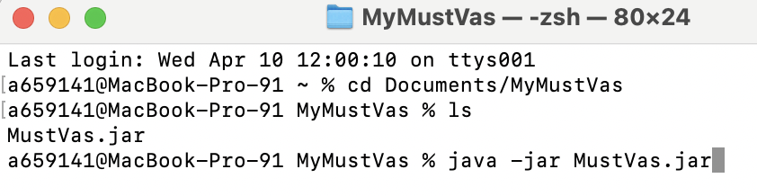

   * 4b. **[For Windows Users]** Open a new command prompt and make sure that you are in the correct directory where MustVas.jar is in. You may use `cd` to navigate into the correct folder, and use the `dir` command to check that your jar file is actually there. Copy and paste this command `java -jar MustVas.jar` into your command prompt.  
_See our Command Prompt guide below._  
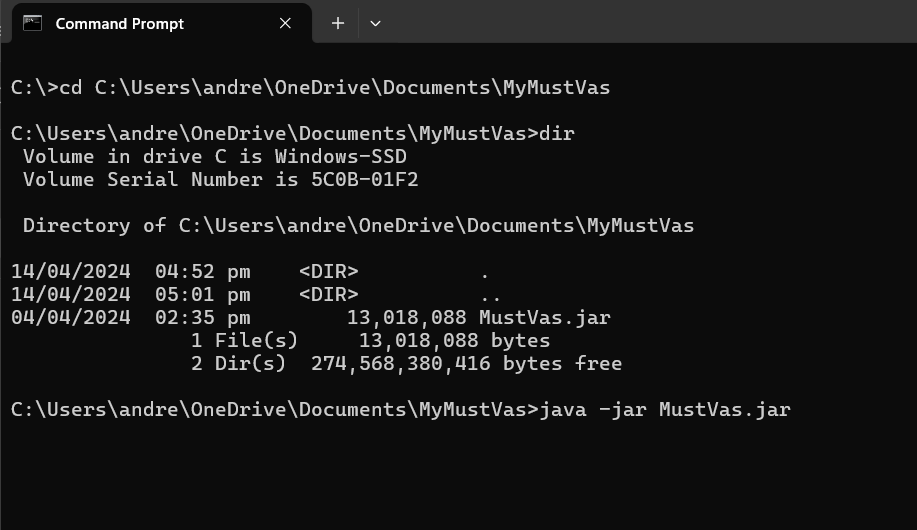
8. An interface similar to the below should appear in a few seconds.  
   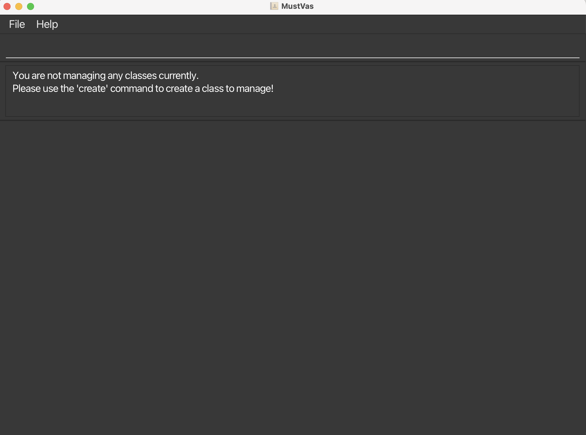

9. Type the command in the command box and press Enter to execute it. e.g. typing **`help`** and pressing Enter will open the help window. 
   Some example commands you can try:

   * `view` : Lists all classes to select from.
  
   * `create c/CS2101` : Creates a class with course code `CS2101` in the Class Book.
  
   * `select 1` : Selects the specified class of index 1 from the class list.

   * `add n/John Doe p/98765432 e/johnd@example.com s/A0251980B` : Adds a student named `John Doe` to the Student Book.
  
   * `adda ar/01-01-2024` : Adds an attendance record with the date `01-01-2024` and a default status `1` to all the existing students.
  
   * `edita 1 ar/01-01-2024 st/0` : Edits the status of the attendance record with the date `01-01-2024` of the first student to `0` (Absent).
  
   * `dela ar/01-01-2024` : Deletes all the attendance record with the date `01-01-2024` from all the students.

   * `delete 1` : Deletes the 1st contact shown in the current list.

   * `clear` : Deletes all contacts.

   * `exit` : Exits the app.

10. Refer to the [Features](#features) below for details of each command.

--------------------------------------------------------------------------------------------------------------------

## Features

<box type="info" seamless>

**Notes about the command format:** 

* Words in `UPPER_CASE` are the parameters to be supplied by the user. 
  e.g. in `add n/NAME`, `NAME` is a parameter which can be used as `add n/John Doe`.

* Items in square brackets are optional. 
  e.g `n/NAME [p/PHONE_NUMBER]` can be used as `n/John Doe p/85018888` or as `n/John Doe`.

* Parameters can be in any order. 
  e.g. if the command specifies `n/NAME p/PHONE_NUMBER`, `p/PHONE_NUMBER n/NAME` is also acceptable.

* Extraneous parameters for commands that do not take in parameters (such as `help`, `list`, `exit` and `clear`) will be ignored. 
  e.g. if the command specifies `help 123`, it will be interpreted as `help`.

* If you are using a PDF version of this document, be careful when copying and pasting commands that span multiple lines as space characters surrounding line-breaks may be omitted when copied over to the application.

### Attribute Summary (Prefixes): 
The meaning of each prefix is listed below:
Attribute     | Prefix (Flag) | Remarks 
-----------|-----------------------|-----------------------------------------------------------------------------------------------------------------------------------------------
**Class Name**    | `c/` | Class name should only contain alphanumeric characters `[a-z, A-Z, 0-9]`.  No duplication is allowed.  Example: `c/cs2103`
**Student Name**  | `n/` | Student name should only contain alphanumeric characters `[a-z, A-Z, 0-9]` and spaces.  Example: `n/John Teo`
**Student Email** | `e/` | No duplication is allowed.   Example: `e/jane@gmail.com`
**Student Id**   | `s/` | Student Id must begin with A, followed by 7 digits, and end with a letter. The last letter will automatically become capitalised.  No duplication is allowed.  Example: `s/A1234567D`
**Student Phone**   | `p/` | Phone must contain only 8 digits from `80000000` to `99999999`.  No duplication is allowed.  Example: `p/88889999`
**Attendance Date**   | `ar/` | Date must be in the format of `dd-MM-yyyy`.  No duplication is allowed.  Example: `ar/01-01-2024`
**Attendance Status**   | `st/` | The status must be either `0`, `1` or `2`.  Example: `st/0`
**Description**   | `desc/` | Description will only keep the latest description.   Example: `desc/This student loves coding.`
</box>

### Viewing help: `help`

Shows a message with a link to our help page.

Format: `help`

### Creating a class: `create`

Creates a new class.

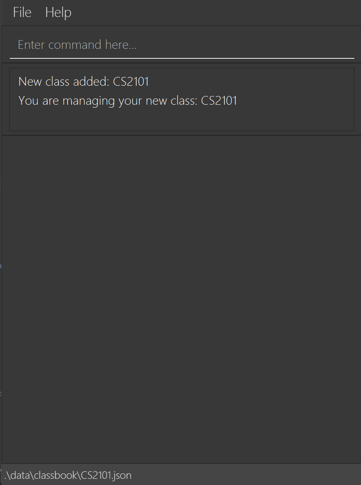

Format: `create c/CLASS_NAME`

* This automatically selects the class you created, so you can modify the class immediately!
* `.\data\classbook\CS2101.json` in the bottom left corner indicates the current class file open in the app.

Examples: 
* `create c/CS2101`: Creates a class with course code 'CS2101'.
* `create c/CS2103T`: Creates a class with course code 'CS2103T'.

### Removing a class: `rm`

Removes the specified class from the ClassBook, and deletes all students in the class.

Format: `rm INDEX`

* Deletes the class at the specified `INDEX`.

### 💡 Index information

The index refers to the index number shown in the displayed class list. (e.g. CS2101 is index 1)
* The index **must be a positive integer** (1, 2, 3, …​)

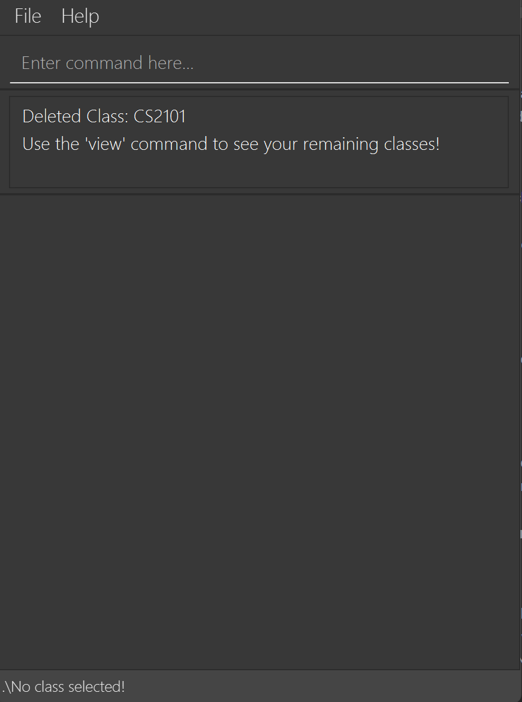
* Removes the class from your ClassBook and entire StudentBook from that class as well, `[JAR file location]/data/classbook/[ClassName].json` will be simultaneously deleted.
* Any classes that are currently selected will be unselected, in order to prevent any accidental modification to your data.
* `.\No class selected!` will be displayed on the bottom left.

### Viewing the classes: `view`

Shows list of classes in result display.

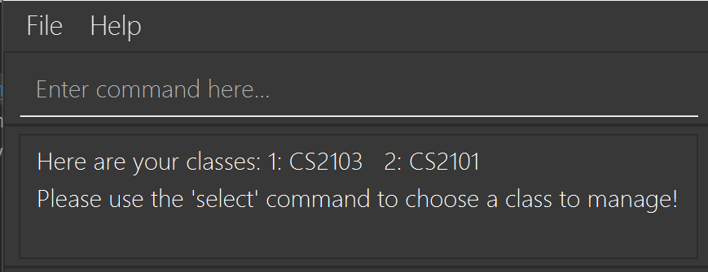
* The index number shown in the displayed class list is used for [Remove](#removing-a-class-rm) and [Select](#selecting-a-class-to-view-select) (e.g. Use index 1 for CS2103)

### Selecting a class to view: `select`

Shows the list of all students in the selected class.
Allows you to modify and view the class.

Format: `select INDEX`

* Selects the class at the specified `INDEX`. This will show you students in the class.
* After selecting a class, you are now able to create, update, and access your students information!
* The subsequent features (i.e. `add`, `delete`, `edit`, `adda`, `dela`, `edita`, `description`, `list`, `find`, `clear`) are to be used after selecting a class.

* In the bottom left corner, you will see the current class file open. In this case, it's `.\data\classbook\CS2103.json`

* The file will always named in the format `CLASS_NAME.json`

## Working with your class

### 💡 Reminder

Before using all functions below, make sure to **select a class** using the `select` command.

This step ensures that you are modifying the correct class!

If you see something like this (with the right class of course!) in the bottom left corner of your MustVas, you're good to go!

### Adding a student: `add`

Adds a student to the StudentBook.

Format: `add n/NAME p/PHONE_NUMBER e/EMAIL s/STUDENT_ID [desc/DESCRIPTION]`

* `STUDENT_ID` must begin with A, followed by 7 digits, and end with a capital letter. The last letter will automatically become capitalised.
* `PHONE_NUMBER` must range from `80000000` to `99999999`. 
* There should not be any duplicate `PHONE_NUMBER`, `EMAIL` or `STUDENT_ID`.
* `NAME` only accepts alphanumerical characters and whitespace (i.e. non-alphanumeric characters such as '/', '-', '$' are not accepted)
* The newly added student will be automatically positioned alphabetically by name.
* The description field is optional. You may write any description for the new student. However, **only one description is allowed**. The old description will be replaced with the new description when editing or adding a new description when one already exists.
* If there are existing attendance records allocated to the existing students, the newly added student will have a default status of '2' (meaning Valid Reason) for these existing attendance records. Please refer to the image below for illustration.

  - You may see our [attendance features](#adding-an-attendance-record-adda) below for more information.

Examples:
* `add n/John Doe p/98765432 e/johnd@gmail.com s/A0251980B`: Adds a new student.
* `add n/John Doe p/98765432 e/johnd@gmail.com s/A0251980B desc/Enjoy coding`: Adds a new student with a description.

### Deleting a student: `delete`

Deletes the specified student from the StudentBook.

Format: `delete INDEX`

* Deletes the student at the specified `INDEX`.
* The index refers to the index number shown in the displayed student list.
* The index **must be a positive integer** 1, 2, 3, …​

Examples:
* `list` followed by `delete 2`: Deletes the 2nd person in the StudentBook.
* `find Betsy` followed by `delete 1`: Deletes the 1st student in the results of the `find` command.

### Editing a student: `edit`

Edits an existing student in the StudentBook.

Format: `edit INDEX [n/NAME] [p/PHONE_NUMBER] [e/EMAIL] [s/STUDENT_ID] [desc/DESCRIPTION]`

* Edits the student at the specified `INDEX`. The index refers to the index number shown in the displayed student list. The index **must be a positive integer** 1, 2, 3, …​
* At least one of the optional fields must be provided.
* Existing values will be updated to the input values.
* If the input values for `PHONE_NUMBER`, `EMAIL` and `STUDENT_ID` already exist (including the target user), the command will be rejected.

Examples:
*  `edit 1 p/91234567 e/johndoe@example.com`: Edits the phone number and email studentId of the 1st person to be `91234567` and `johndoe@example.com` respectively.
*  `edit 2 n/Betsy Crower`: Edits the name of the 2nd person to be `Betsy Crower`.

### Adding an attendance record: `adda`

Add an attendance record to all existing students in the studentId book.

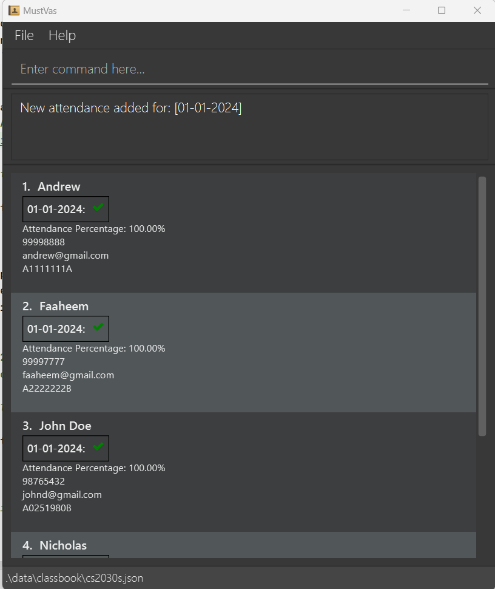

Format: `adda ar/DATE`

* The format for `DATE` is `dd-MM-yyyy`.
* The entered date, `DATE`, must not exist in any of the student's existing list of attendance dates.
* The newly added attendance record will be automatically sorted based on the date.
* The default value for status is '1' for 'Present'.
* If a new student has been added and there are existing attendance record, using the `adda` command will produce a default status value of '2' for 'Valid Reason'.

  
### 💡 Status information
* Note the representation for `STATUS`:
    - 0 for 'Absent', represented by a red cross ❌ 
    - 1 for 'Present', represented by a green tick ✅ 
    - 2 for 'Valid Reason', represented by a blue dot 🔵 
* To edit the status value, do refer to the [edita](#editing-an-attendance-for-any-number-of-students-edita) command below.
  

Examples:
*  `adda ar/01-01-2024`: All the existing students will have a newly added attendance with date `01-01-2024` and a default status `1`.

### Editing an attendance for any number of students: `edita`

Edits the existing attendance record in the student's list of attendance in the studentId book. **Any number of students** can be edited in one go.

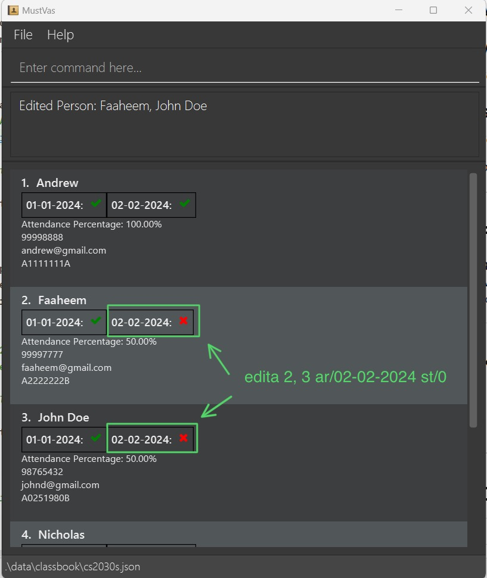

Format: `edita INDEX1, INDEX2, …​ ar/DATE st/STATUS`

* The format for `DATE` is `dd-MM-yyyy`.
* Edits the student at the specified `INDEX(S)`. The index refers to the index number shown in the displayed student list. The index **must be a positive integer** 1, 2, 3, …​, up to the size of the class.
* The command requires at least one index to be present at a time, though **multiple indexes** is also allowed, the latter of which needs to be separated by commas.
* All the selected student will have their status of the selected attendance date, `DATE`, to be reflected to `STATUS`
  * The entered date, `DATE`, must exist in the student's existing list of attendance dates.

  
### 💡 Recall Status information 
  * Recall the representation and valid inputs for `STATUS`:
    - 0 for 'Absent', represented by a red cross ❌ 
    - 1 for 'Present', represented by a green tick ✅ 
    - 2 for 'Valid Reason', represented by a blue dot 🔵

Examples:
*  `edita 1 ar/01-01-2024 st/2`: Edits the attendance status of the 1st student for `01-01-2024` to `2`, indicating absence with a valid reason.
*  `edita 2, 3 ar/01-01-2024 st/0`: Edits the attendance status of the 2nd and 3rd student for `01-01-2024` to `0`, indicating absence.

### Deleting an attendance record: `dela`

Deletes the specified attendance date from all the student's list of attendance records in studentId book.

Format: `dela ar/DATE`

* The format for `DATE` is `dd-MM-yyyy`.
* The entered date, `DATE`, must exist in the student's existing list of attendance dates.
* Deletes the specified date, `DATE` from all the student's list of attendance records.

Examples:
* `dela ar/02-02-2024`: Deletes the attendance record, `02-02-2024`, from all students' existing list of attendance records.

**Additional tips for Attendance taking**  
- For quick attendance taking, here are the 3-4 steps that you can take:
  1. Use the `adda` command to mark everyone as present.
  2. Find the indexes of students who are absent and those who have valid reasons.
  3. Use the `edita` command to mark them as absent/having a valid reason at one shot.
- Moreover, to facilitate easier reading of a student's attendance records, we have an attendance percentage bar (see highlights below) that displays the overall score of a student's attendance that you can view at a quick glance. The attendance percentage is calculated by this formula `(# of present + # of valid) / # of attendance records`

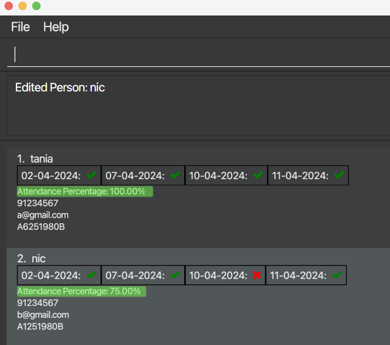

### Adding\Editing a description: `description`

Adds a description to the selected student or Updates an already existing description of the selected student with the given description.

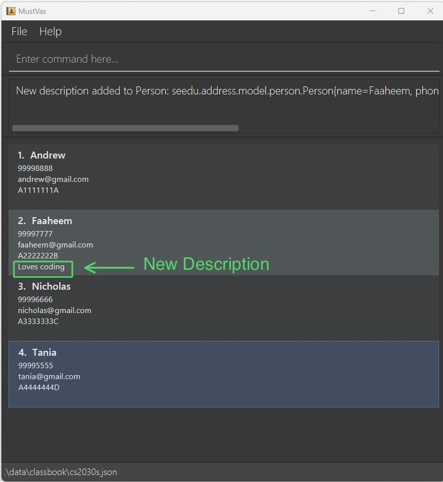

Format: `description INDEX desc/DESCRIPTION`

* **Only one description is allowed**. The old description will be replaced with the new description (i.e., when we add/edit a description when one already exists.)
* **Can use special characters**. To accommodate for adding tele handles, percentages/grades, dates etc.

Examples:
*  `description 1 desc/Loves coding`: Adds a description `Loves coding` to first student.
*  `description 2 desc/Absent on 29/04/2023 due to Case Competition`: Adds a description `Absent on 29/04/2023 due to Case Competition` to second student on the list.

### Listing a class to view: `list`

Lists all students in the class.

Format: `list`

### Locating students by name: `find`

Finds students whose names contain any of the given keywords.

Format: `find KEYWORD [MORE_KEYWORDS]`

* The search is case-insensitive. e.g `andrew` will match `Andrew`
* The order of the keywords does not matter. e.g. `Nic Faaheem` will match `Faaheem Nic`
* Only the name is searched.
* Only full words will be matched e.g. `andr` will not match `andrew`
* Students matching at least one keyword will be returned (i.e. `OR` search).
  e.g. `Tania Tan` will return `Tania Low`, `Tania Ooi`

Examples:
* `find andrew`: Returns `andrew` and `Andrew`

  
* `find nic faaheem` returns `nic`, `faaheem` 
  
* `find John Doe` returns `John Doe`, `Johnathan Doe`, `Johnette Doe` 
    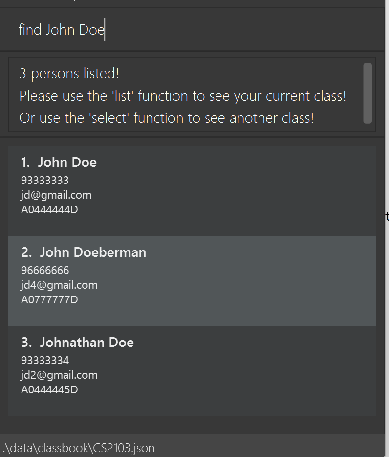

**Warning**
> If multiple search terms are used, all search terms will be matched with full words as well as incomplete words!

### Clearing all entries: `clear`

Clears all entries from the StudentBook in a selected class.

⚠️ Caution: Upon initiating the command to clear all students from the StudentBook, no further prompts will follow.  This action is irreversible and once executed, the data cannot be retrieved.

Format: `clear`

### Exiting the program: `exit`

Exits the program.

Format: `exit`

### Saving the data

ClassBook and StudentBook data are saved automatically after any command that changes the data. There is no need to save manually. You can find the same in the data folder (which is going to be in the same directory as the application (i.e., .JAR file).

### Editing the data file

ClassBook and StudentBook data are saved automatically as a JSON file `[JAR file location]/data/classbook.json` and `[JAR file location]/data/classbook/[ClassName].json` respectively. Advanced users are welcome to update data directly by editing that data file.

<box type="warning" seamless>

⚠️ **Caution:** 
- If your changes to the classbook.json data file makes its format invalid (e.g. `"courseCode" : "class_1"` where `class_1` contains non-alphanumeric characters), ClassBook will discard its classes in the classlist and start with an empty data file at the next run. Fortunately, in this case, your StudentBook data (e.g. `class1.json`) will not be lost. It can be recovered by simply recreating the class of that same name in the application (e.g. using the `create` command to `create c/class1`). 
- Furthermore, certain edits to the individual JSON files can cause the application to behave in unexpected ways (e.g. if a value entered is outside the acceptable range, if field names such as `courseCode` are modified, etc.). In the worst case, an invalid modification to the data will cause the program to crash. In this scenario, you are advised to manually delete the modified files before running the program again. 
- As such, do refrain from editing  manually in the JSON file. Edit the data file only if you are confident that you can update it correctly.
</box>

### Coming Soon...
**Clear All**: Instead of manually using the `rm` command to remove each individual class, or the `clear` command to clear the selected StudentBook, this feature will clear all data (including ClassBooks and their respective StudentBooks), increasing convenience for users.

--------------------------------------------------------------------------------------------------------------------

## FAQ

**Q**: Unable to start the program? 
**A**: Ensure that Java 11 or above is installed in your operating system. To check if you have Java 11 or above, open the Command Prompt and type in `java -version`. Once verified, navigate to the program's directory and type in `java -jar MustVas.jar` in the Command Prompt. 

**Q**: How do I transfer my data to another Computer? 
**A**: Install the app in the other computer and overwrite the empty data file it creates with the file that contains the data of your previous AddressBook home folder.

**Q**: How can I see the class that I am on right now?  
**A**: You can see the class that you have currently selected in the bottom left corner of the application (as shown below).  
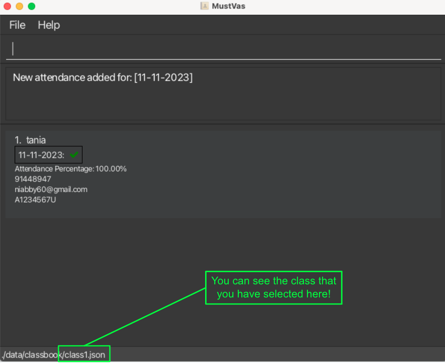

**Q**: How can I manually delete students/classes?  
**A**: Find your data folder in your home directory where MustVas is stored. In this folder, you will see the `classbook.json` file that contains the list of _courseCode_s, as well as another classbook folder that contains the individual `.json` files of the StudentBook, named after its class name. 
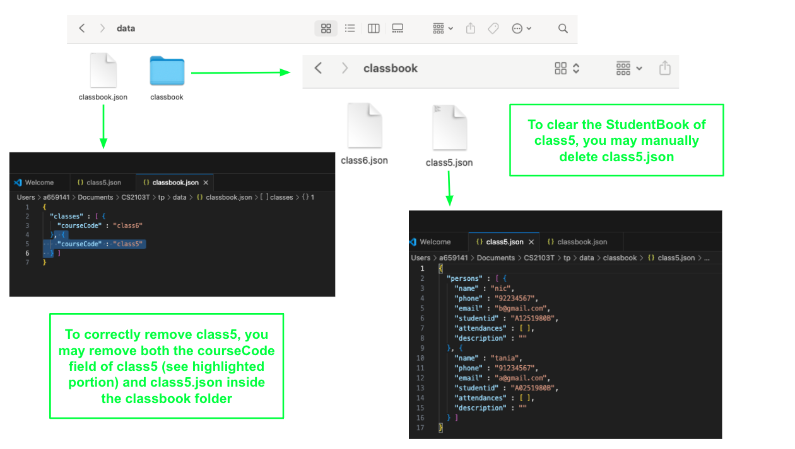
- You may delete the individual StudentBook by deleting its individual .json file under the classbook folder. Do note that doing so will be akin to using the `clear` command on that class, effectively setting an empty StudentBook to be used.
- However, if you do intend to manually delete an entire class, do remember to delete both its _courseCode_ field in `classbook.json` and its respective `.json` file in the classbook folder. Otherwise, deleting just the _courseCode_ field in the `classbook.json` file would cause the same StudentBook to be used if a class of the same _courseCode_ is created again (i.e. `create c/class5` would reuse its old StudentBook with its old student contacts and not create a new empty StudentBook).

**Q**: How do I fix "This student already exists in the class" error?  
**A**: This error is likely due to duplicate fields in `PHONE`, `EMAIL` or `STUDENT_ID`. Check that the new student to be added does not have these duplicate fields that are already present among students in your current class.

--------------------------------------------------------------------------------------------------------------------

## Known issues

1. **When using multiple screens**, if you move the application to a secondary screen, and later switch to using only the primary screen, the GUI will open off-screen. The remedy is to delete the `preferences.json` file created by the application before running the application again.
2. **When using view after selecting a class**, if you are viewing your list of classes after having selected a class, the StudentBook of the previously selected class is still considered selected (and will be displayed). Any commands entered to modify this class will take effect until another class is selected from the list of classes.

--------------------------------------------------------------------------------------------------------------------

## Command summary

Action     | Format, Examples
-----------|----------------------------------------------------------------------------------------------------------------------------------------------------------------------
**Add**    | `add n/NAME p/PHONE_NUMBER e/EMAIL s/STUDENT_ID [desc/DESCRIPTION]`   e.g., `add n/James Ho p/22224444 e/jamesho@example.com s/A1111111D desc/Loves coding `
**Clear**  | `clear`
**Delete** | `delete INDEX`  e.g., `delete 3`
**Edit**   | `edit INDEX [n/NAME] [p/PHONE_NUMBER] [e/EMAIL] [s/STUDENT_ID] [desc/DESCRIPTION]​`  e.g.,`edit 2 n/James Lee e/jameslee@example.com`
**Find**   | `find KEYWORD [MORE_KEYWORDS]`  e.g., `find James Jake`
**List**   | `list`
**Help**   | `help`
**View**   | `view`
**Select** | `select INDEX`   e.g., `select 1`
**Create** | `create c/CLASS_NAME`   e.g., `create c/CS2103`
**Remove** | `rm INDEX`   e.g., `rm 2`
**Add Attendance**   | `adda ar/DATE`   e.g., `adda ar/01-01-2024`
**Edit Attendance**  | `edita INDEX1, INDEX2, …​ ar/DATE st/STATUS`   e.g., `edita 1 ar/01-01-2024 st/2`
**Delete Attendance** | `dela ar/DATE`   e.g., `dela ar/02-02-2024`
**Add\Edit Description** | `description INDEX desc/DESCRIPTION`   e.g., `description 1 desc/Loves coding`

## Glossary
Term     | Abbreviations | Definition 
-----------|-----------------------|-----------------------------------------------------------------------------------------------------------------------------------------------
**Command Line Interface**    | CLI | A text-based interface for interacting with a computer system or program by typing commands into a terminal or command prompt.
**Graphical User Interface**  | GUI |  A visual interface that allows users to interact with a computer system or program through graphical elements such as windows, icons, buttons, and menus.
**Command Prompt**   | - | A command line interpreter application available in most Windows operating systems that allows users to enter commands to perform tasks.
**Terminal**   | - | A text-based interface for interacting with a computer system or program by typing commands, commonly found in Unix-like operating systems.
**Change Directory** | `cd` | A command used in command line interfaces to change the current working directory to a specified location within the file system.
**List**   | `ls` | A command used in command line interfaces to list the contents of a directory or folder.
**Directory**   | `dir` | A command used in command line interfaces, particularly in Windows operating systems, to list the contents of a directory or folder.
**Java ARchive**   | `jar`   `JAR` | A file format used to package Java class files, associated metadata, and resources into a single file for distribution or deployment.
**JavaScript Object Notation** | `json`   `JSON` | A file format that is easy for humans to read and write, and easy for machines to parse and generate, commonly used for transmitting data between a server and a web application.
