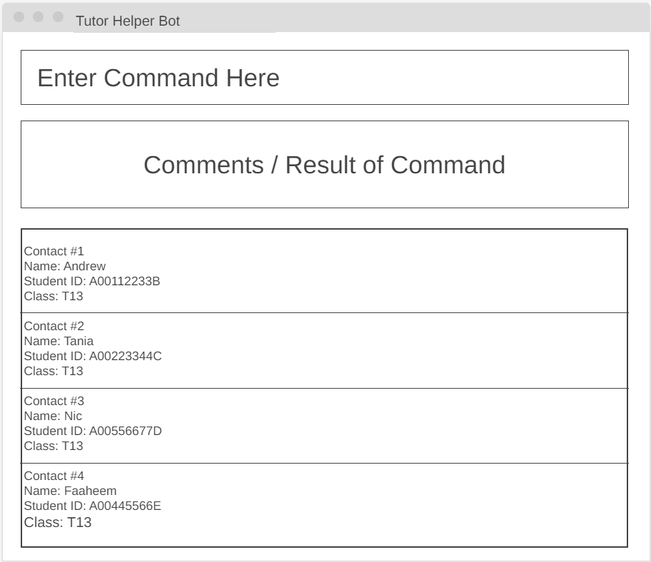

# MustVas

**MustVas is a desktop application for managing your students' attendance records.** While it has a GUI, most of the user interactions happen using a CLI (Command Line Interface).

* If you are interested in using MustVas, head over to the ([User Guide](https://ay2324s2-cs2103t-t13-1.github.io/tp/UserGuide.html#quick-start)).
* If you are interested about developing AddressBook, the ([Developer Guide](https://ay2324s2-cs2103t-t13-1.github.io/tp/DeveloperGuide.html).html) is a good place to start.

**Acknowledgements**

* Libraries used: [JavaFX](https://openjfx.io/), [Jackson](https://github.com/FasterXML/jackson), [JUnit5](https://github.com/junit-team/junit5)
